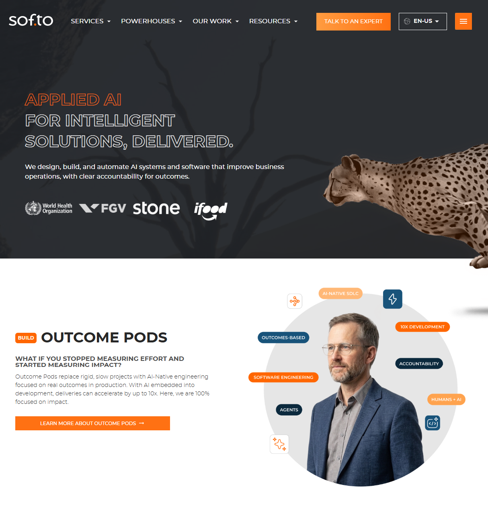

# Softo 🚀
**Applied AI for Intelligent Solutions, Delivered**

---

## Who We Are

Softo is a fully remote, Brazil-based company focused on **applied AI, custom software, and intelligent automation**. We design, build, and operate AI-powered software for real business operations, with accountability for tangible delivery and measurable impact.

Founded in 2013, we have served organizations ranging from startups to large enterprises like WHO/OMS, FGV, Stone, iFood, Iugu, and CEPEL. We work where there is real process complexity and a need to ship faster, with quality, in the Autonomous Era.

---

## How We Engage

### Outcome Pods
Our flagship delivery product. Cross-functional, AI-native squads that take responsibility for business outcomes across full software development, systems integration, and intelligent automation. All work is priced and consumed in **outcome tokens**, with different work types consuming tokens at different rates.

Inside Outcome Pods, **Agentic Now** is our named service for autonomous agents, agentic workflows, and intelligent process automation, applied to real workflows and integrations.

---

## What We Do

Web and mobile applications, APIs and systems integration, cloud, automation and RPA, data-driven systems, UX design, blockchain and smart contracts, and applied AI including LLM-based systems, RAG architectures, AI agents, multi-agent systems, and AI-powered workflow automation.

Our delivery stance is simple: we sell delivery capacity oriented to outcomes, accelerated by AI across the software lifecycle. Not headcount, not hours, not body shop allocations.

---

## Quickstart: Get Involved

1. **Explore Our Work:** browse our [GitHub organization](https://github.com/SoftoDev) for open-source efforts.
2. **Try Pulse:** take our AI dev maturity assessment at [pulse.sof.to](https://pulse.sof.to).
3. **Talk to Us:** reach out through any channel below.

* * * * *

Have Questions? Want to Chat or Connect?
-----------------------------

-   **Website**: [sof.to](https://sof.to)
-   **Email**: <hello@sof.to>
-   **X**: [@SoftoDev](https://x.com/SoftoDev)
-   **LinkedIn**: [Global](https://www.linkedin.com/company/softodev/) or [Brasil](https://www.linkedin.com/showcase/softo-global/)
-   **Instagram**: [@SoftoDev](https://www.instagram.com/softodev/)
-   **Facebook**: [SoftoDev](https://www.facebook.com/SoftoDev/)
-   **TikTok**: [@SoftoDev](https://www.tiktok.com/@softodev)
-   **YouTube**: [SoftoDev](https://www.youtube.com/@softodev)
-   **Backlog Talks Podcast**: [Spotify](https://open.spotify.com/show/76sO52XgMhV0iSWAZ64kJs?si=e9ccef09aa6e4467) or [YouTube](http://www.youtube.com/@BacklogTalks)

* * * * *

How to Get Involved
-------------------

-   **Work with Us**: open roles at [sof.to/for-talents](https://sof.to/for-talents).
-   **Partner Up**: contact us at <partners@sof.to>.

* * * * *

A Little About Us
-----------------

Softo was founded in 2013 by Fabio Seixas (CEO) and Rafael Ruiz (CTO). More than a decade in, we are focused on applying AI to real business and operational problems, with responsibility for tangible delivery. Learn more at [sof.to/about](https://sof.to/about).

* * * * *
